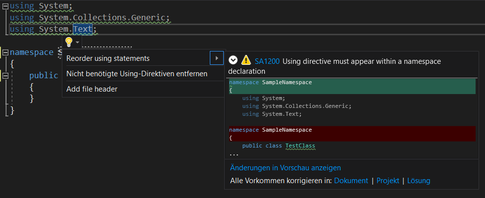

# Testing Guide

This is an overview on how to test the project.

## Prerequisites

- Setup [.NET Framework](https://dotnet.microsoft.com/download) **Version 4.6.1+** or [.NET Core](https://dotnet.microsoft.com/download) **Version 2.0+**

## Install dependencies and tools

Restore the dependencies and tools of the project

```sh
$ dotnet restore
```

## Test

Tests are written in [xUnit.net](https://xunit.net).

Tests should be structured like this:
- Create own test class for each class to test
- Create nested class inside test class for each method to test
- Name of a test method should describe the test

Here you can find more information about test structuring:
- https://haacked.com/archive/2012/01/02/structuring-unit-tests.aspx/
- https://zendeveloper.blogspot.com/2012/01/structuring-unit-tests.html

To execute all tests run:
```sh
$ dotnet test
```

## Code Style Test

We use [StyleCop Analyzers](https://github.com/DotNetAnalyzers/StyleCopAnalyzers) as nuget package to check StyleCop rules during build process.

After you have build code, check for new StyleCop issues. They are shown as warnings.
```sh
$ dotnet build
```

Possible rule violations can be found in the [StyleCop Documentation](https://github.com/DotNetAnalyzers/StyleCopAnalyzers/blob/master/DOCUMENTATION.md)

Some rules can be auto-fixed by Visual Studio


## Unit Test

Run `unit tests`

```sh
$ dotnet test tests\Fraunhofer.IPA.MSB.Client.API.Tests.Unit
$ dotnet test tests\Fraunhofer.IPA.MSB.Client.Websocket.Tests.Unit
```

## Integration Test

Run `integration tests` against local or remote MSB instance:

```sh
$ dotnet test tests\Fraunhofer.IPA.MSB.Client.Websocket.Tests.Integration
```

## Test Coverage

The code coverage library [coverlet](https://github.com/tonerdo/coverlet) is used. To calculate the coverage correctly Coverlet is configured via coverage.rsp. The resulting coverages of each test project must be merged. You can use [test.bat](../tests.bat) / [tests.sh](../tests.sh) to execute all tests with coverage and generate a html report via [ReportGenerator](https://github.com/danielpalme/ReportGenerator). The html report is generated in `artifacts/coverage/report/index.html`.

The integration tests use a public avaible MSB instance:
- [GUI](https://gui.15xr.msb.oss.cell.vfk.fraunhofer.de/)
- [SmartObjectMgmt](https://so.15xr.msb.oss.cell.vfk.fraunhofer.de/)
- [IntegrationDesignMgmt](https://flow.15xr.msb.oss.cell.vfk.fraunhofer.de/)
- [Websocket Interface](https://ws.15xr.msb.oss.cell.vfk.fraunhofer.de/)


